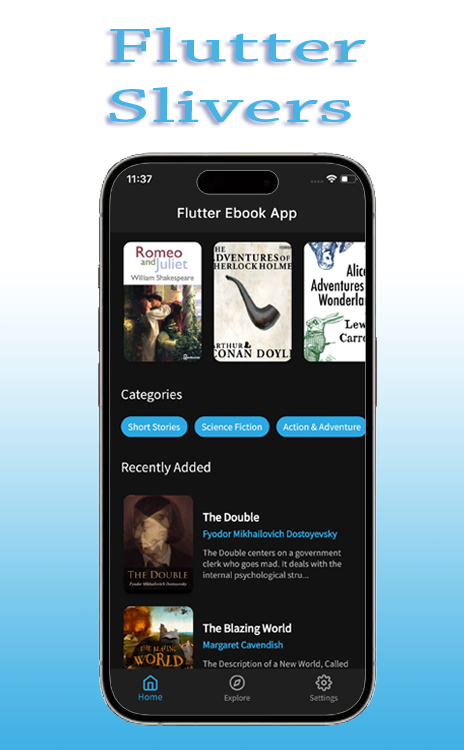
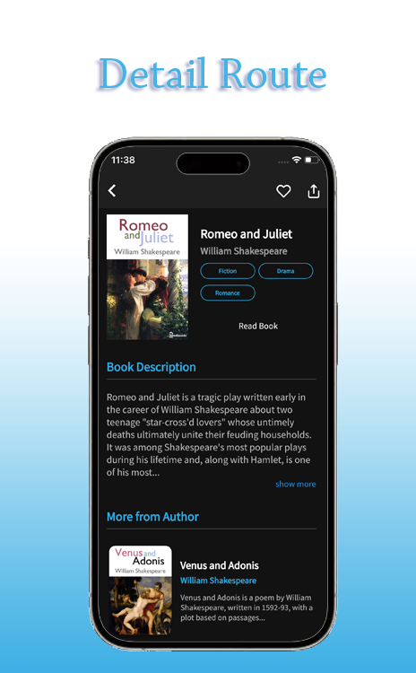
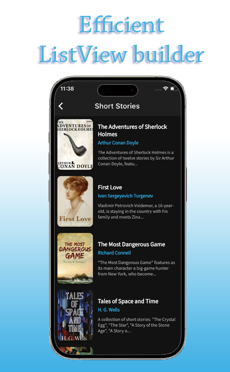
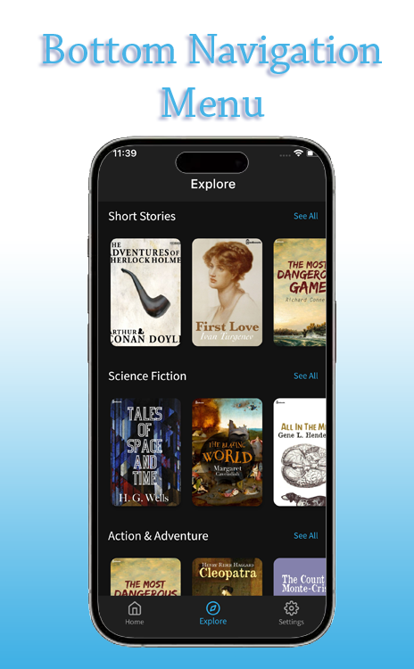
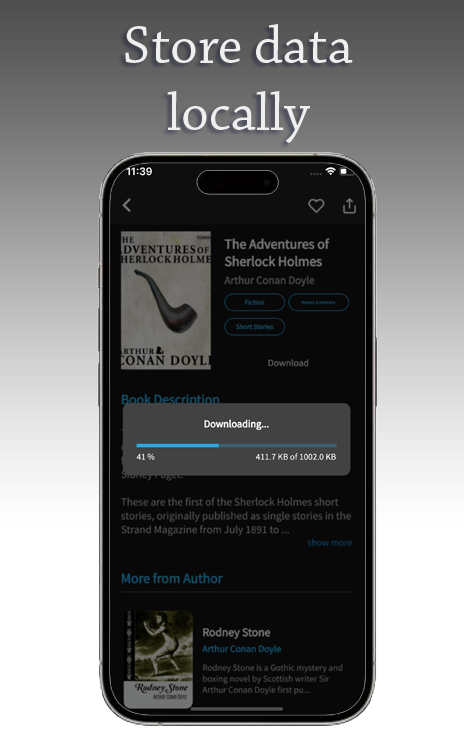
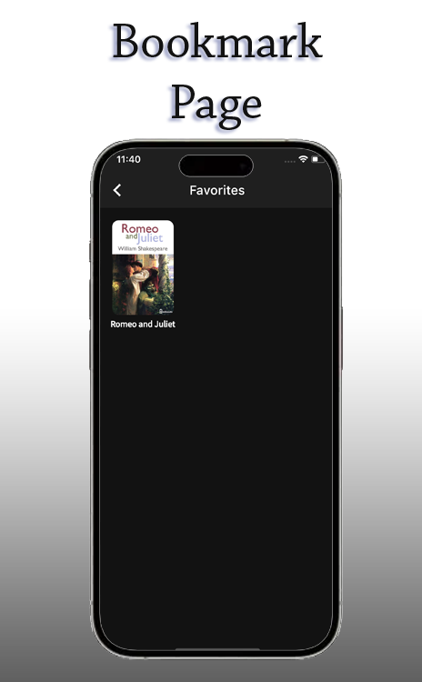

# Various-Projects
A Repository to showcase some pervious portfolios
## Image sharing platform

  
  
  
  
  
  

Image sharing application, built using the powerful Flutter framework and designed with the robust Bloc architecture. This app is ultimate destination for all things visual, offering a unique image editing capability that empowers you to unleash your creativity like never before.

## eBookrary application

  
  
  
  
  
  

This application combines the power of Bloc architecture and the efficiency of Hive local database, ensuring a user experience that's not only visually stunning but also incredibly responsive and intuitive.

## Developers forum

  
  
  
  
  

This platform is designed to cater to individuals with a keen interest in participating in various devfestivals and technology-related gatherings happening worldwide. This application serves as a comprehensive repository of details concerning tech-centric occasions, making it an invaluable resource for tech enthusiasts looking to attend such events.

In this app, you will find a wealth of information about a wide array of tech events, ensuring that users can easily access pertinent details for planning their attendance. From event schedules and locations to speaker lineups and registration procedures, this application offers a one-stop solution for staying informed and engaged in the dynamic world of technology conferences and
devfestivals.

This app provides the tools you need to make informed choices about which events to attend and how to make the most of your experience
